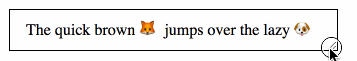
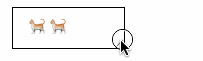

<div align="center">
  <h1>reFLEXible 🐈</h1>
  <b>RE</b>sponsible and <b>FLEX</b>ible string, which automatically shifts to the best for the task. 
  <br/>
  
  <br/>  
  
  <br/>
  <a href="https://www.npmjs.com/package/react-nyan-stroller">
   
  </a>  
</div> 

__RE__-sponsible and __FLEX__-ible string. Automatically picks string
perfectly fitting available space, without any JS or media queries involved.

Based on [overflower](http://kizu.ru/en/blog/flexible-overflow/#ie11), Pure HTML, works in IE11+.

# API
Reflexible exports 2 Components - `Reflexible`, `FlexiblePick`, which both use the same internal API.

1. __Reflexible__ - automatic string selection. Content inside `Try` might not be displayed
if there is no _width_ for it.
```js
import {Reflexible, Try} from 'react-reflexible';

<Reflexible><Try>Please</Try> Star <Try>⭐️ </Try>Reflexible</Reflexible>
// will print "Please Star⭐ Reflexible" or "Please Star Reflexible" or ""Star Reflexible" 

<Reflexible><Try>⚛️</Try>React</Reflexible>
// will print "⚛ React" or "React"
``` 
Reflexible is a good fit for simples cases. It will print all content, or content without Try.

2. __FlexiblePick__ - picks the best match from the list
```js
<FlexiblePick
    try={[
      "The quick brown fox jumps over the lazy dog",
      "The quick brown 🦊 jumps over the lazy 🐶",
      "The ⚡️ brown 🦊 ⬆️ over the 🐢 🐶",
      "⚡️ 🦊 ⬆️ 🐢 🐶",
    ]}
/>
``` 

Probably you need FlexiblePick

# Licence 
MIT


